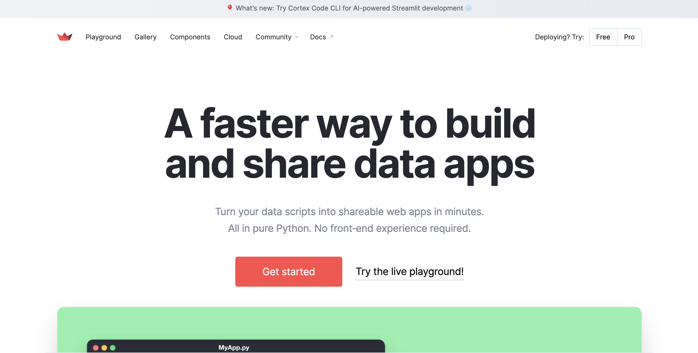
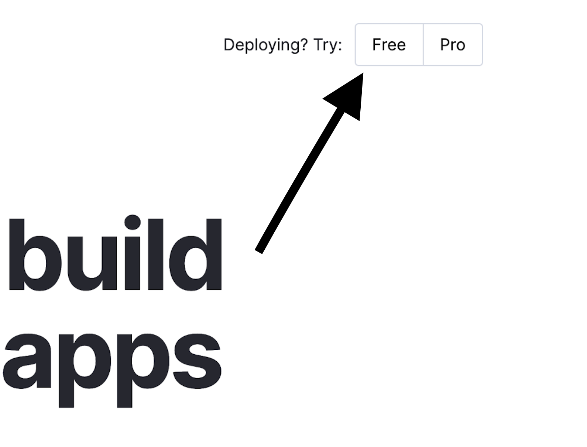
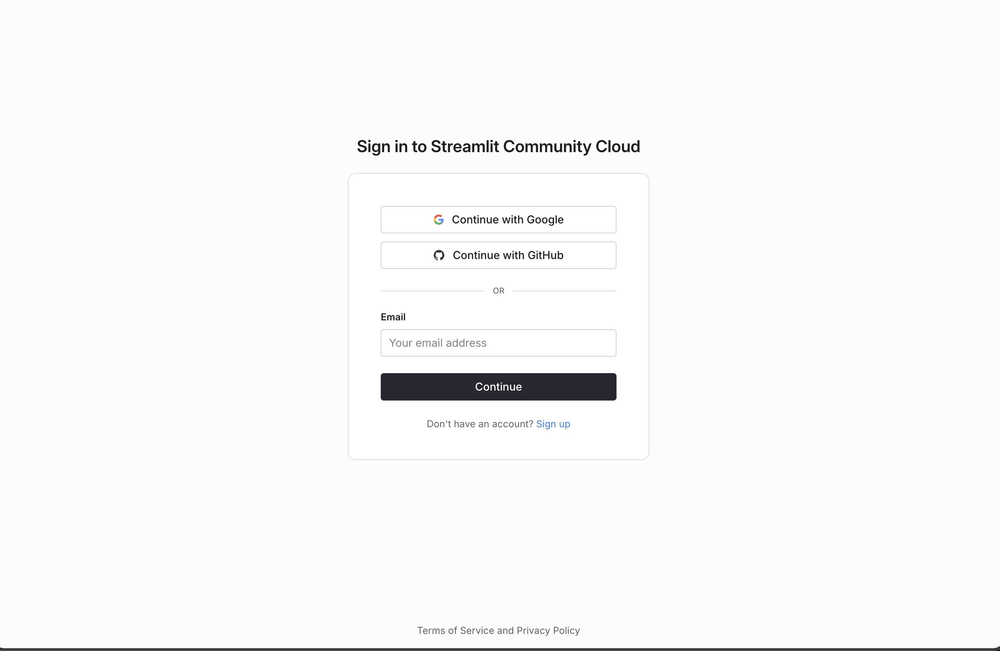
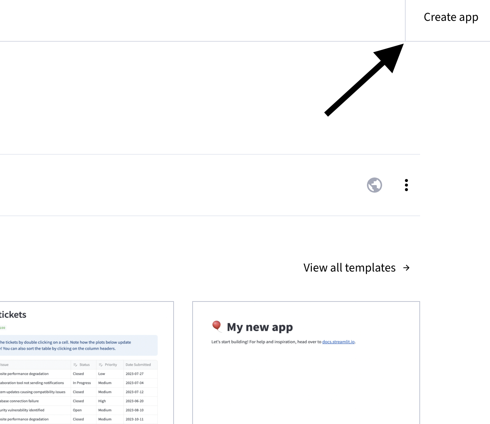
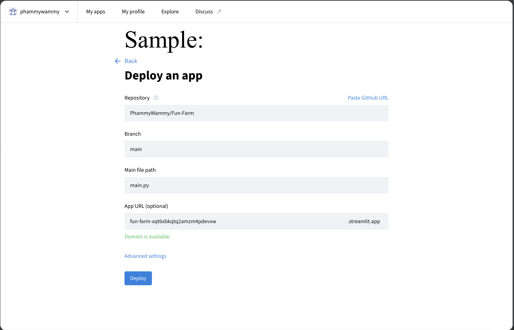

# Fun-Farm

Farming Game

Link to Game!(follow how to host the game steps first)

https://fun-farm-255aeejyvpgqlgcqtyevxs.streamlit.app/

## How I hosted this:

### Step 1:

Go to the search bar and enter `streamlit.io` and it should take you to this page.

### Step 2:

Look at the top right corner and click the free option

### Step 3:

Click the sign in button to end up with two option to create a streamlit account. It should look like this.

### Step 4:

Once signing in it takes you to the tab `My apps` and now you are able to create you own app by pressing "Create app" at the top right corner of the website.

### Step 5:

When creating your own app you will be able to see the option `Deploy a public app from GitHub` and now you choose a repository from your drop down bar, choose "main" branch, `main.py` for main file path, and it should give you a custom domain.

### Step 6:

Press deploy and now you have created your very own app!

## Example of How To Play

### Step 1:

Start of by buying tomato and/or potato seeds in the Market as it is the beginning of your farming journey.

### Step 2:

Make your way to the field and plant the seed that you have purchased. At the moment, you are only able to play 1 seed at a time since beginners start with only one plot.

### Step 3:

Next is the watering for your tomato/potato seed. Go to the water sub tab and click `use water`. Every time you click `use water` it will consume 4% of your total water.

### Step 4:

Head to harvest sub tab and tap `harvest` to claim the tomato/potato that you have planted and don't forget to weed your plot in the plant sub tab as you will not be able to grow the seeds that you have bought until it is weeded.

### Step 5:

Head to the Market and sell the plants that you have grown to make a profit.

Goal:

Buy all the plots and become the richest farmer!
